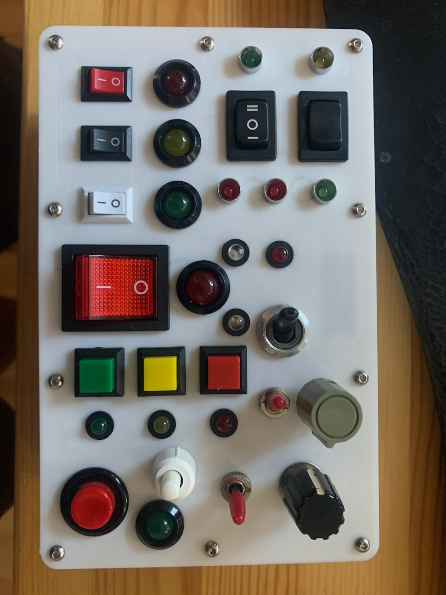
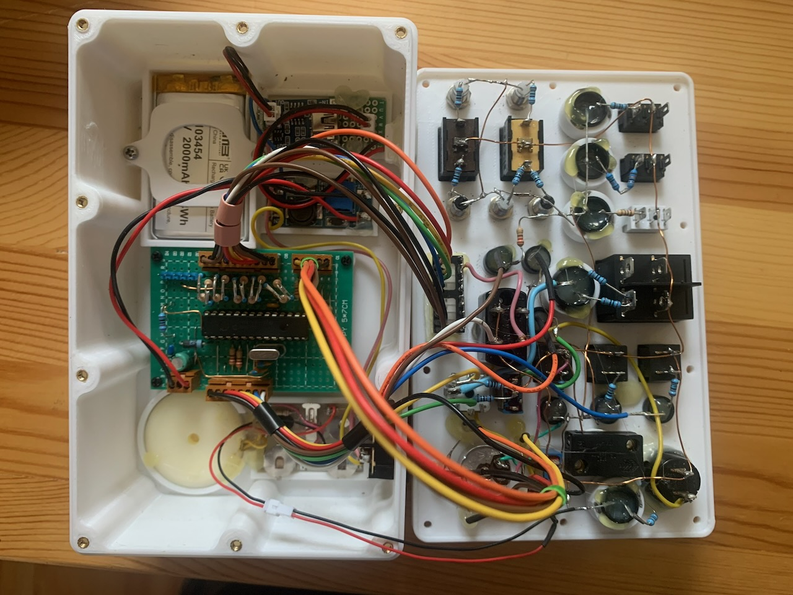

# BusyBox (PIC16F876a LED Controller)

A versatile microcontroller-based light effects controller designed for a "BusyBox" toy or experimental board. The project uses a **PIC16F876a** to drive multiple LED arrays with interactive controls for pattern selection and speed, see this [video](https://youtube.com/shorts/YxFTMH3q9yA) for a demo.

## Hardware Components

The system controls three distinct LED outputs running in parallel:

*   **10-LED Bar**: A linear display using 10 LEDs (8 on PORTB, 2 on PORTC).
*   **5-LED Ring**: A circular arrangement of 5 LEDs.
*   **Dual-LED Blinker**: Two independent LEDs that alternate or blink in sync.

### Interactive Controls

*   **Rotary Encoder**: Used to cycle through various display modes and animation sets.
*   **Potentiometer**: Provides real-time control over the animation speed (via internal ADC).
*   **Hardware Kill-Switch**: A physical switch connected in parallel with the outputs allows the user to turn the LEDs on or off manually without affecting the program state of the PIC controller.

## Functionality Overview

The program is built around a non-blocking main loop and timer-driven interrupts to ensure responsive interactions:

1.  **Multiple Animation Modes**: 
    Each LED group supports several modes, including:
    *   **Rotating**: Lights moving left or right.
    *   **Bouncing**: A single light or "void" bouncing between edges.
    *   **Center-Out/In**: Animations expanding from or contracting to the center.
    *   **Counting**: Binary counting on the LED bar.
    *   **Random**: Chaotic blinking patterns using a pseudo-random generator.
    *   **Synced-Blink**: Periodic flashing.

2.  **Parallel Execution**: 
    The patterns for the bar, ring, and blinkers are updated simultaneously. When the mode is changed via the rotary encoder, all three sub-systems switch to their next predefined configuration.

3.  **Variable Speed**: 
    The system reads the analog value from the potentiometer and maps it to a delay table, allowing for a wide range of speeds from very slow crawls to rapid-fire strobes.

## Development & Build

### Prerequisites
*   **Microchip XC8 Compiler**
*   **MPLAB X IDE** (optional, Makefile provided)
*   **PIC16F876a** Microcontroller

### Project Structure
*   `main.c`: Core logic, initialization, and main loop.
*   `ledbar.c / .h`: Logic for the 10-LED linear bar patterns.
*   `ledring.c / .h`: Logic for the 5-LED circular ring patterns.
*   `ledblink.c / .h`: Logic for the dual-LED blinker.
*   `rotary.c / .h`: Driver for the quadrature rotary encoder.
*   `analog.c / .h`: ADC management for the speed potentiometer.
*   `macro.h / config.h`: Hardware configuration and utility macros.

## Pin Mapping (Typical)

*   **PORTA**: Analog inputs (Speed Pot), Rotary Encoder inputs, and Blink LED outputs.
*   **PORTB**: LED Bar (Bits 0-7).
*   **PORTC**: LED Bar (Bits 6-7), LED Ring (Bits 0-1, 3-5).

---
*Developed for PIC16F876a.*
